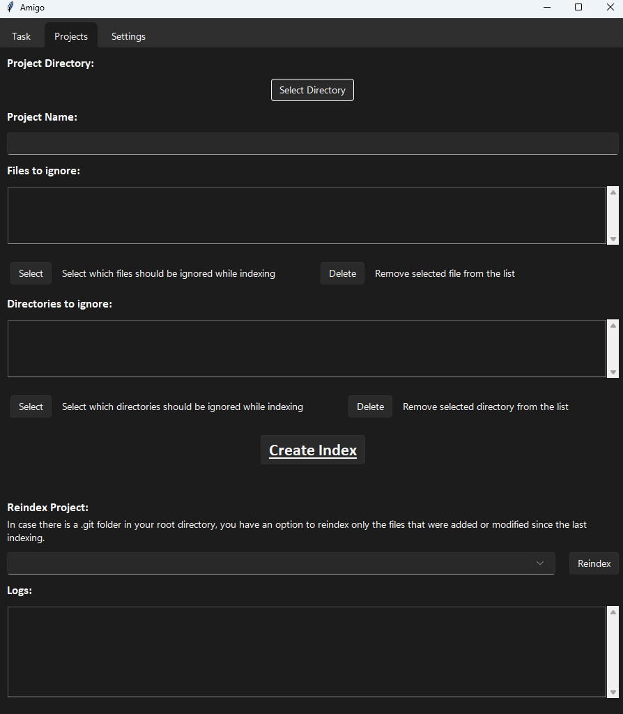
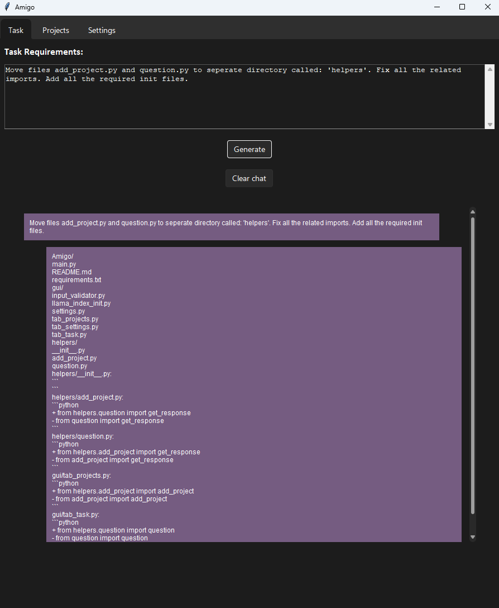

# Amigo AI 🔥- software project assistant

## Description
This application is designed to assist with software projects. It creates embeddings of your entire
project and provides you with useful information and possible solutions for your Tasks. Currently, 
it supports 3 AI Models: OpenAI, Azure OpenAI and Gemini.

## Architecture

- python 3.11
- llama_index
- tkinter
- Supported AI Models: `OpenAI`, `Azure OpenAI` and `Gemini`

## Setup

### Install dependencies

```bash
pip install -r requirements.txt
```

### Run the application

```bash
python3 main.py
```

## Usage

1. **SETTINGS:** When you are first time using the application, you will need to set all the required settings. Go to Tab Settings
and fill in all the required fields. Settings will be saved to `app_settings.json` file when the application exits and 
will be loaded when you start the application for the second time.


2. **PROJECTS:** Go to tab Projects and click on the button `Select Directory`. Fill in the Project name and optionally the select 
which files should be ignored. Proceed and click on the button `Create Index`. This will create an index of your entire
project. Once it will finish, you will see text 'Done' under the button, and you will be able to select the project 
in the list of projects.



3. **TASKS:** Go to tab Tasks and enter your task Description. Then click on the button `Run Generation`. This will 
generate possible solutions for your task.



## Contributing

If you want to contribute to this project, create a PR or contact me.

## Donations

If you like this project, you can buy me a coffee :)

[](https://ko-fi.com/coolpointerexception)
